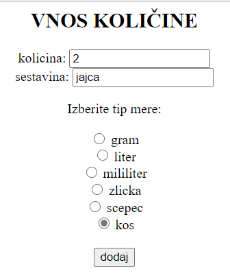

# Tortopretvornik

Tortopretvornik pretvori količine sestavin za željeno velikost torte.

## Dodajanje polmerov

Polmer pekača, ki ga najdemo v receptu dodaš tako, da vpišemo polmer v centimetrih na sledeči [povezavi](http://127.0.0.1:8080/dodaj_polmer1/)

Polmer pekača, ki pa se nahaja v naši kuhinji, dodamo tako, da vpišemo polmer v centimetrih na sledeči [povezavi](http://127.0.0.1:8080/dodaj_polmer2/)

## Dodajanje sestavin

Dodajanje sestavin se nahaja na sledeči [povezavi](http://127.0.0.1:8080/dodaj_kolicino/), dodamo jih pa tako, da vpišeš količino sestavine iz recepta,vrsto sestavine in izbereš tip mere količine. 
Na primer 

## Izpiši nov recept

Na koncu ti program izpiše nov recept s pretvorjenimi sestavinami.

Za zagon programa moraste zagnati skripto tortopretvornik.py
